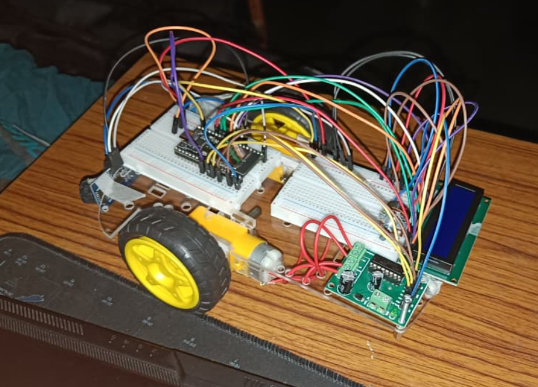

# ESP32 Smart Multi-Functional Robot Car

  

## Overview

This project is an ESP32-based smart robot car capable of wireless Bluetooth control using a smartphone. It integrates multiple hardware modules to provide real-time monitoring, obstacle detection, and user interaction.

---

## Features

- Bluetooth-controlled movement
- Display custom messages on a 16×2 LCD
- Ultrasonic distance measurement
- IR-based obstacle detection
- Real-time distance display
- Motor control using L293D

---

## Hardware Used

- ESP32 Development Board
- 16×2 LCD
- HC-SR04 Ultrasonic Sensor
- IR Sensor
- L293D Motor Driver
- DC Motors
- Robot Chassis
- Battery Pack

---

## Software Used

- Arduino IDE

---

## Skills Demonstrated

- Embedded Systems
- ESP32 Programming
- Bluetooth Communication
- Sensor Interfacing
- Motor Control
- Hardware Integration
- Electronics Prototyping
- Embedded C++

---

## Future Improvements

- Wi-Fi Control
- Obstacle Avoidance
- Mobile Application
- Battery Monitoring
